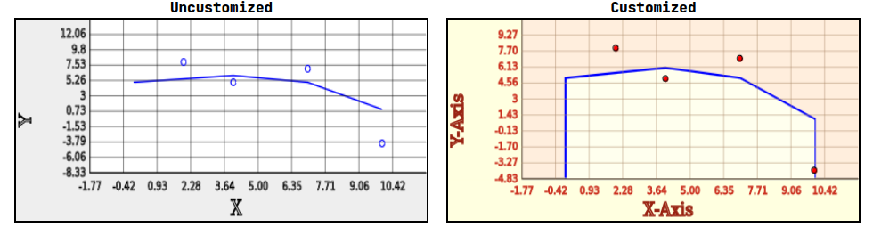

# canvas_graph
A basic chart component made with html canvas, which currently can do scatter and line plots. Also supports dragging and zooming in with a mouse.


## usage example in react
```
<Graph 
  className="border-2 border-black"
  xy_data={[data1, data2]}
  plot_type={["line", "scatter"]}
  individual_options={[{fill : true, line_width: 3.5, area_color: "#ffffee"}, {elem_color: "black", area_color: "red", fill: true}]}
  global_options={{axis_titles: {x:  "X-Axis", y: "Y-Axis"}, 
    axis_titles_color: "#992211", 
    axis_titles_width: 1.6,
    axis_numbering_color: "#cc3322",
    axis_numbering_width: 1,
    bg_axis_area: "lightyellow",
    bg_color: "#ffeedd",
    gridline_color: "#aa8866",
    chart_border_color: "#000000"}}
/>

```
data1 and data2 are arrays of coordinates like so: [[x0, y0], [x1, y1], ... ,[xn, yn]]. plot_type and individual_options change the styling of the data at the relevant index, while global_options contains styling options that are global to the chart.

### standard style vs the style from the example above

